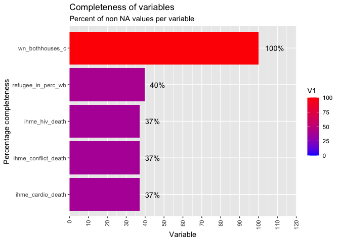
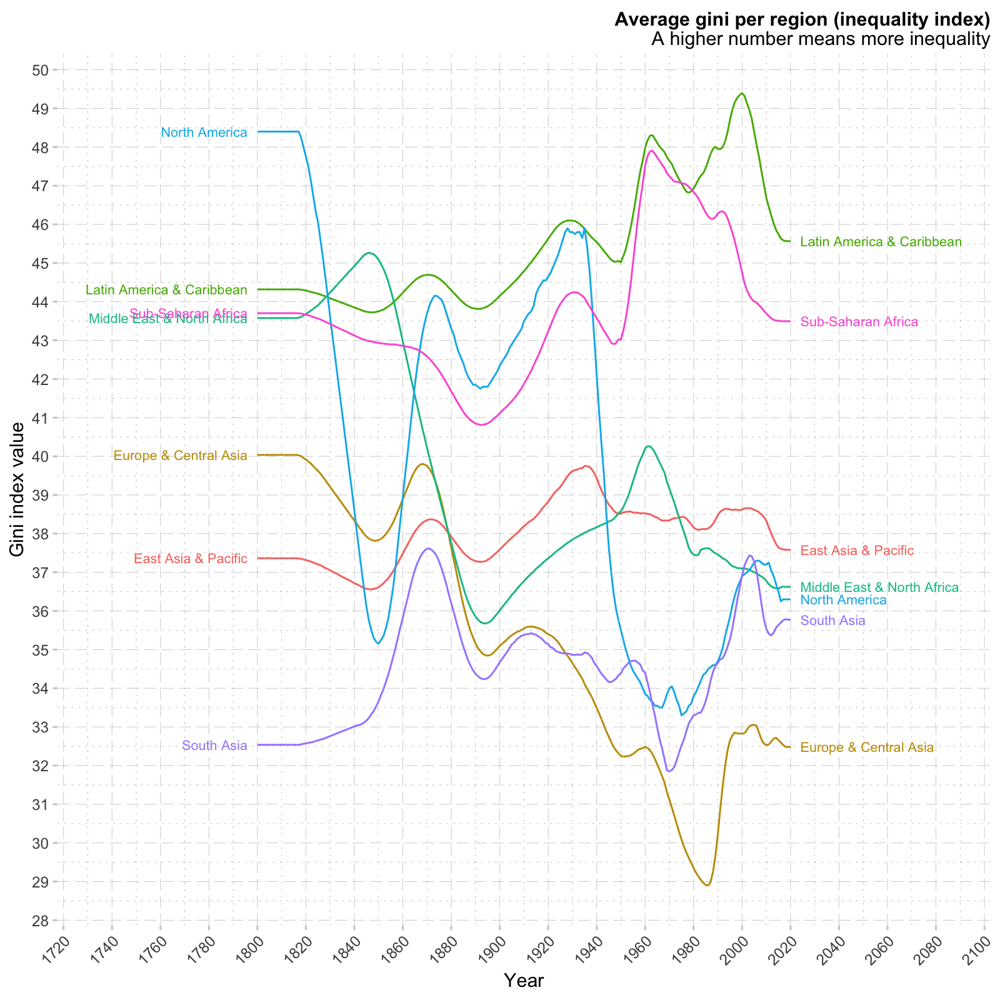
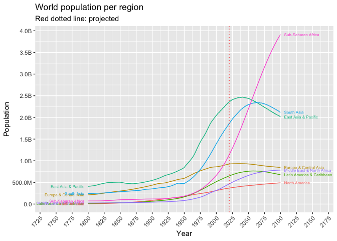
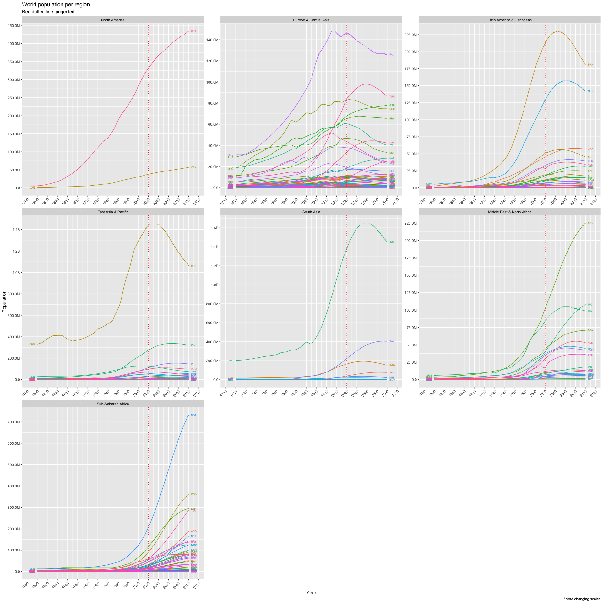
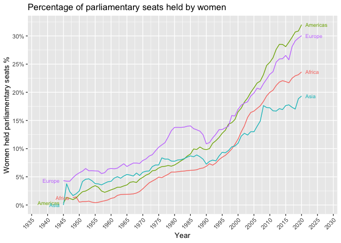
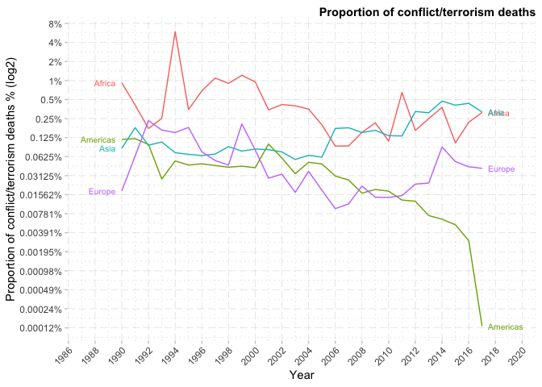

# ds-gapminder

Visualisation and analysis skills by analysing gapminder datasets. Packages used: tidyverse, ggplot2, plotly, xml2, rvest and more.

I wanted to analyse the gapminder datasets. I did this is a few parts.

1. Cleaning, organising and merging the datasets.
1. Exploratory analysis.
1. Final plots and display website; D3.js.

# Example visualisations

    
    
    
    
    
    

