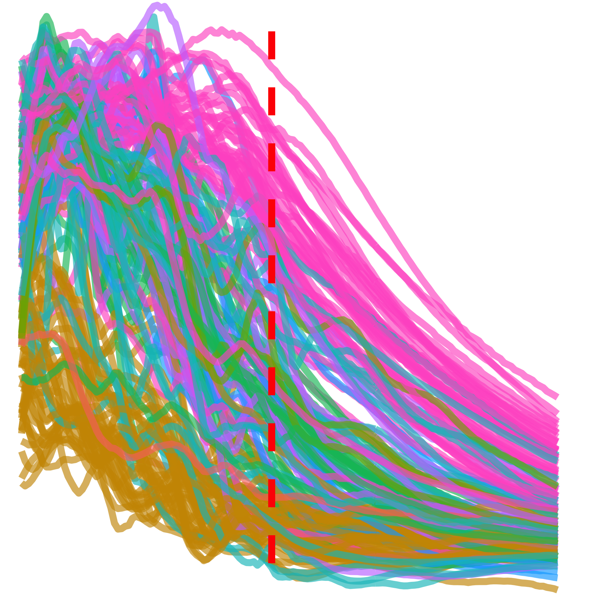

# ds-geo-social-datascope 

Visualisation and analysis skills by analysing geospatial datasets relating to human life and society. Tech stack includes `R`, `tidyverse`, `ggplot2`, `plotly`, `xml2`, `rvest`; `SQLite`; `JavaScript`, `D3.js`; `HTML`, and `CSS`.

The ultimate goal is to analyse the multiple datasets from various sources and build a single page website for displaying some beautiful graphics using `D3.js`. I did this is a few parts:

1. Cleaning, organising and merging the datasets.
1. Exploratory analysis and visualisations with `ggplot2`.
1. Final plots and website; `JavaScript`, `D3.js`.

# Project structure

You can find all preliminary analysis and work done with R in the `R-analysis` directory. In the `website` directory you'll find all work done with `JavaScript` and `D3.js`.

## Website structure

Tech stack will include and work in the following way:

1. `ExpressJS` framework - for server creation.
1. `SQL` database - stores and manages data.
1. `Nginx` as a reverse proxy - avoids exposing server and relays client requests.
1. `NodeJS` server - runs `SQL` and `ExpressJS` server.
1. `JavaScript` - used front end and back end.
1. `SCSS` - use for styling; better than `CSS` for its modularity.
1. `HTML` - front end code.
1. `D3.js` - visualisation library.

# Preprocessing datasets

Preprocessing these datasets was a rather tedious matter. Unfortunately these do not always come in a neat and ready to use format. Preprocessing includes, merging, removing trash data, reformating, and manipulating data to fit the `tidy` structure - note that these often are presented in **multiple** `.csv` files. Reading these in all at once and working from a list is essential:

```r
fontes <- lapply(list.files("./data/united-states-of-america/per-county-votes-20-fontes/", full.names = TRUE), read.csv)
names(fontes) <- gsub(".csv", "", list.files("./data/united-states-of-america/per-county-votes-20-fontes/"), perl = TRUE)
```

The trick is to list the files and pass this to the `read.csv` function through `lapply` then name the objects in the list.

Some of the aforementioned preprocessing techniques are demonstrated in the following example. For more information consult the preprocessing scripts.

## Gapminder

The data was taken from the [gapminder website](https://www.gapminder.org) and github repositories: [open-numbers/ddf--gapminder--fasttrack](https://github.com/open-numbers/ddf--gapminder--fasttrack).

Unfortunately the datasets provided are quite messy, it is difficult to obtain the full dataset, and manual download is often necessary for obtain certain ones. Most data is avaialable in the linked repository, but some is only available by manual download. Moreover, this data presents itself in short format. 

Reshaping the data into long format was done by the `clean-data.Rmd` script. There I use a list object to read in all data files, name the object and execute a custom algorithm for reshaping the data and passing the file name to a column name:

First the data is read and put into long format. This is held by a list object.

```r
reshape_manual_data <- function(x) {
	shift_long <- function(x) {
        column_to_rownames(x, "country") %>%
        t() %>% as.data.frame() %>%
        rownames_to_column("year") %>%
        mutate(year = gsub("X", "", year)) %>%
        reshape2::melt() %>%
        return()
	}
	
	shifted <- lapply(x, shift_long)
	
	for(i in 1:length(x)) {
		colnames(shifted[[i]])[3] <- names(x)[i]
	}
	return(shifted)
}
```

This list object is now merged to produce a single dataset, NA are inserted where necessary to keep all rows.

```r
data$manual <- Reduce(function(...) {
	merge(..., all = TRUE)
}, reshape_manual_data(data$manual))
```

Finally all the data is saved to the `SQLite` database found in the `sql` directory. I then use this database with `JavaScript` and `D3.js` to produce the website.

# ggplot2 visualisations

<p align="center">
    
    
    
    
</p>

<p align="center">
    
    
    
    
    
    
    <!--  -->
    <!--  -->
    <!--  -->
</p>

<p align="center">
    
    
    
    
    
    
</p>

# Data sources

## gapminder

- Downloaded tables from their website: https://www.gapminder.org/data/
- https://github.com/open-numbers/ddf--gapminder--fasttrack

## US census data

- GDP per county: https://apps.bea.gov/iTable/iTable.cfm?reqid=70&step=1&acrdn=5
- Census data: https://www.census.gov/data/tables/time-series/demo/popest/2010s-counties-total.html#par_textimage
   - https://www.census.gov/data/tables/time-series/demo/popest/2010s-counties-total.html
   - https://www2.census.gov/programs-surveys/popest/technical-documentation/file-layouts/2010-2019/co-est2019-alldata.pdf
- Economic Research Service United States Department of Agriculture
    - Includes Unemployment, Education, PovertyEstimates: https://www.ers.usda.gov/data-products/county-level-data-sets/download-data/

## Vote datasets
- https://www.kaggle.com/unanimad/us-election-2020
- https://projects.fivethirtyeight.com/2020-election-forecast/
- https://simonrogers.net/2016/11/16/us-election-2016-how-to-download-county-level-results-data/
	- https://github.com/tonmcg/US_County_Level_Election_Results_08-20