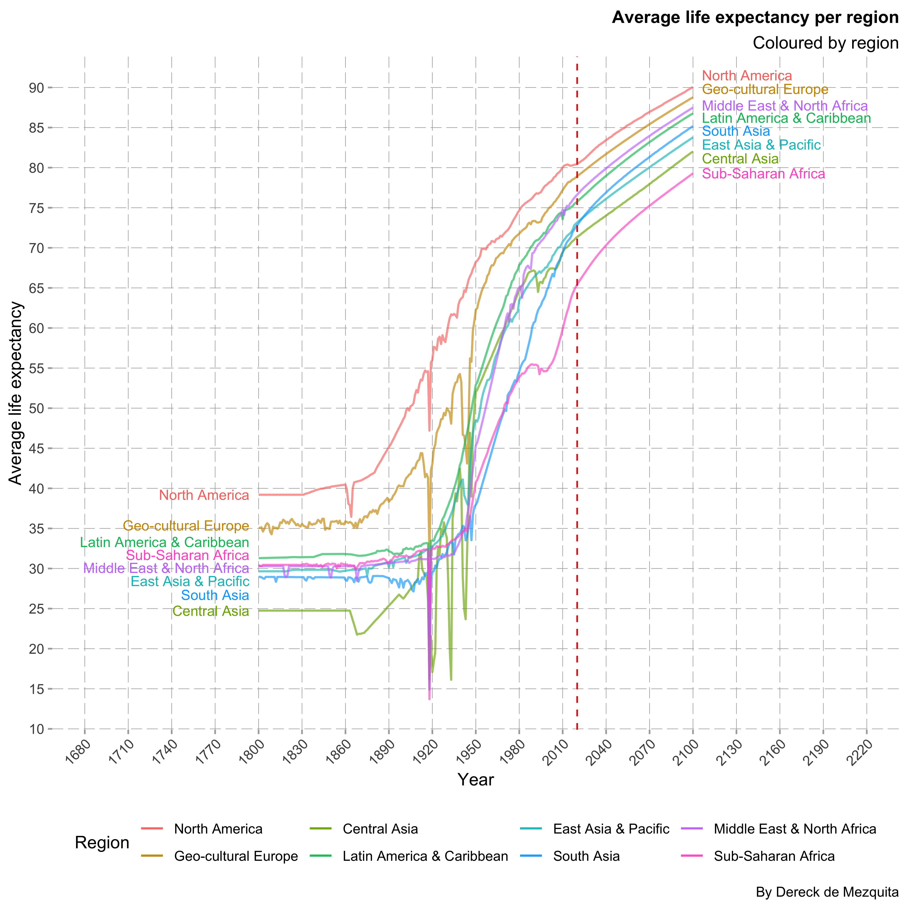
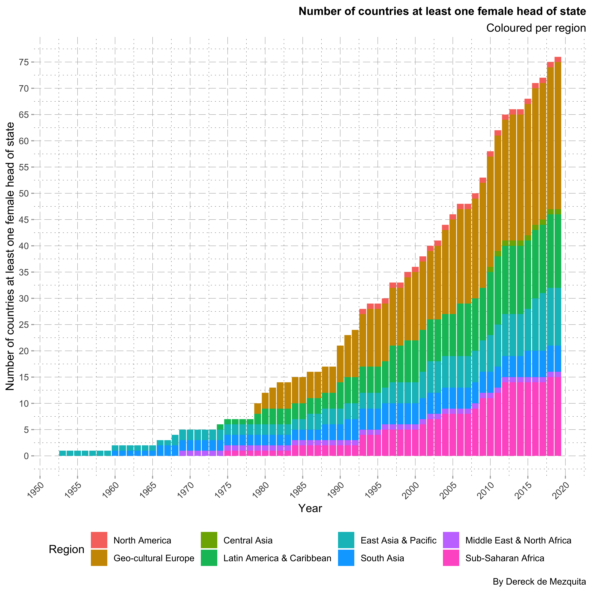
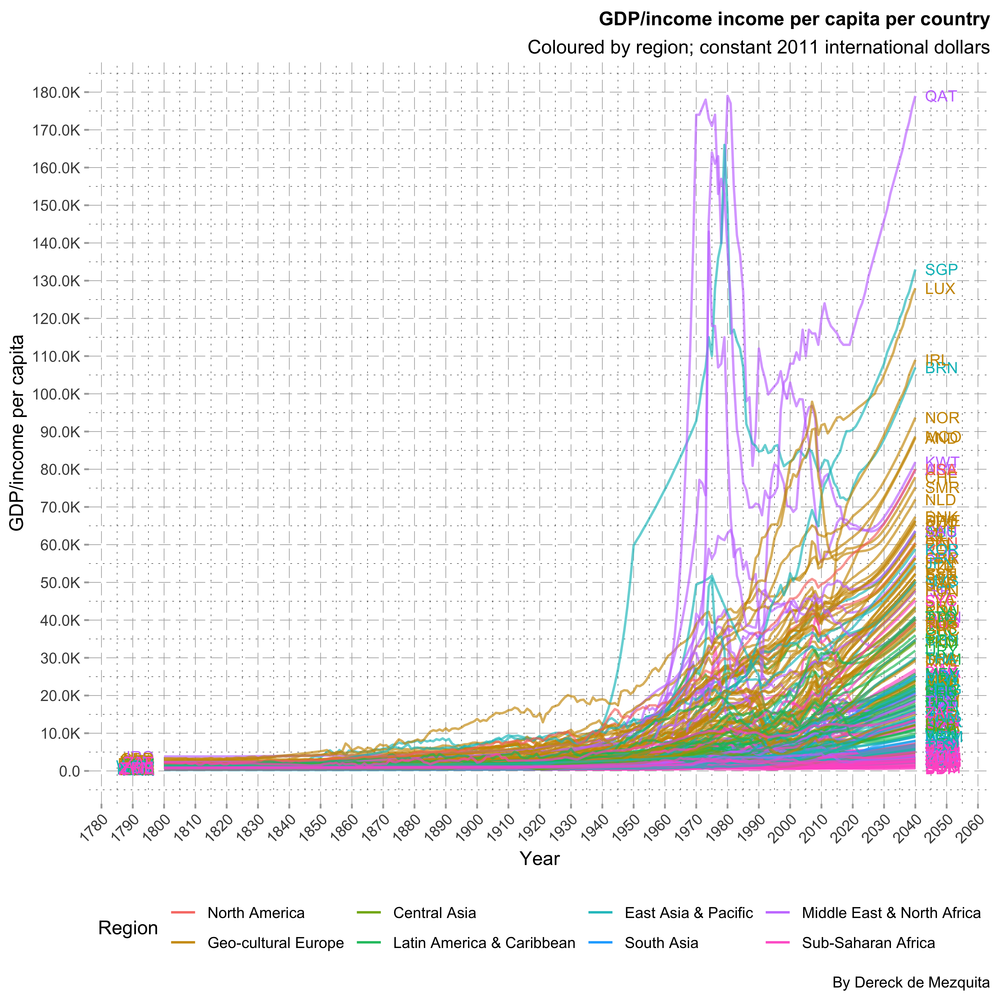
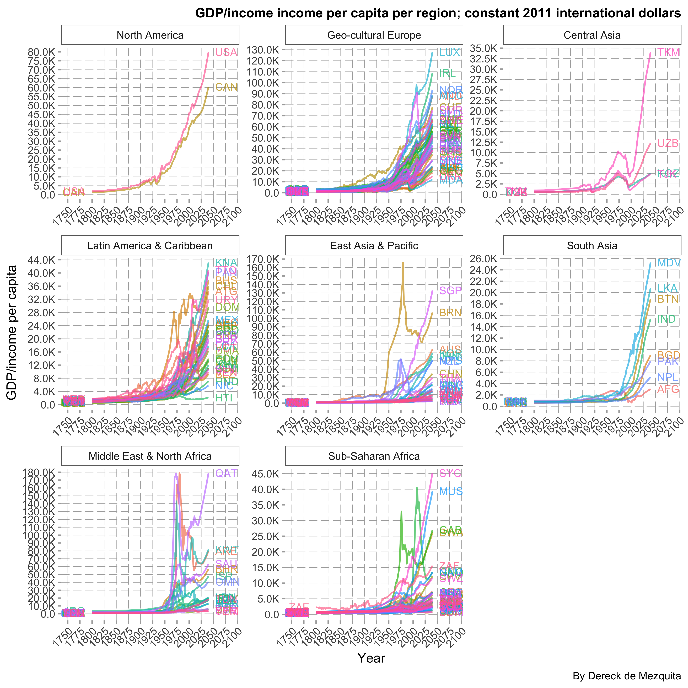
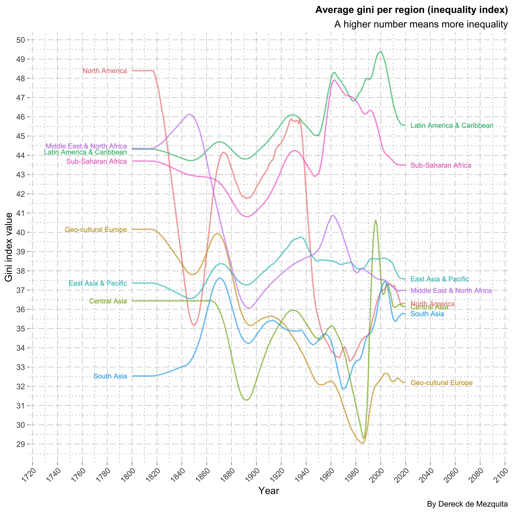
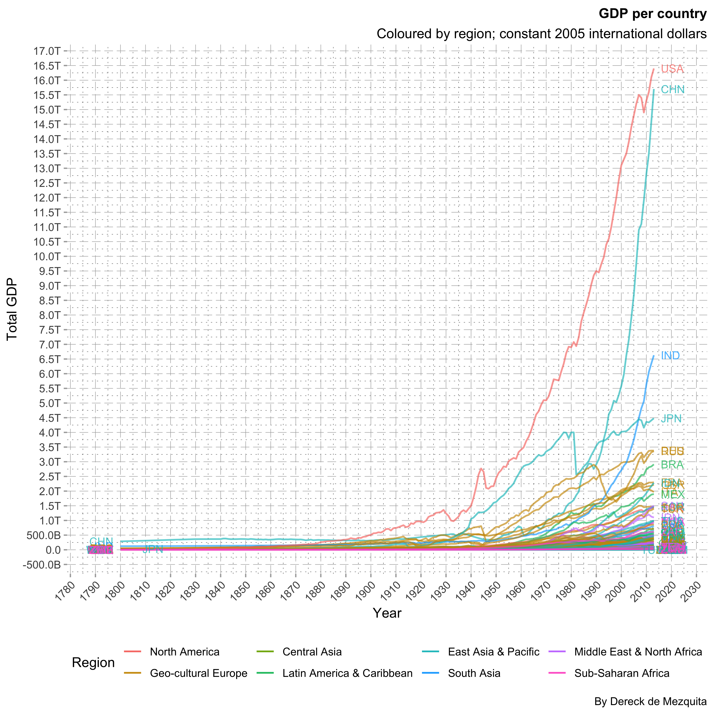
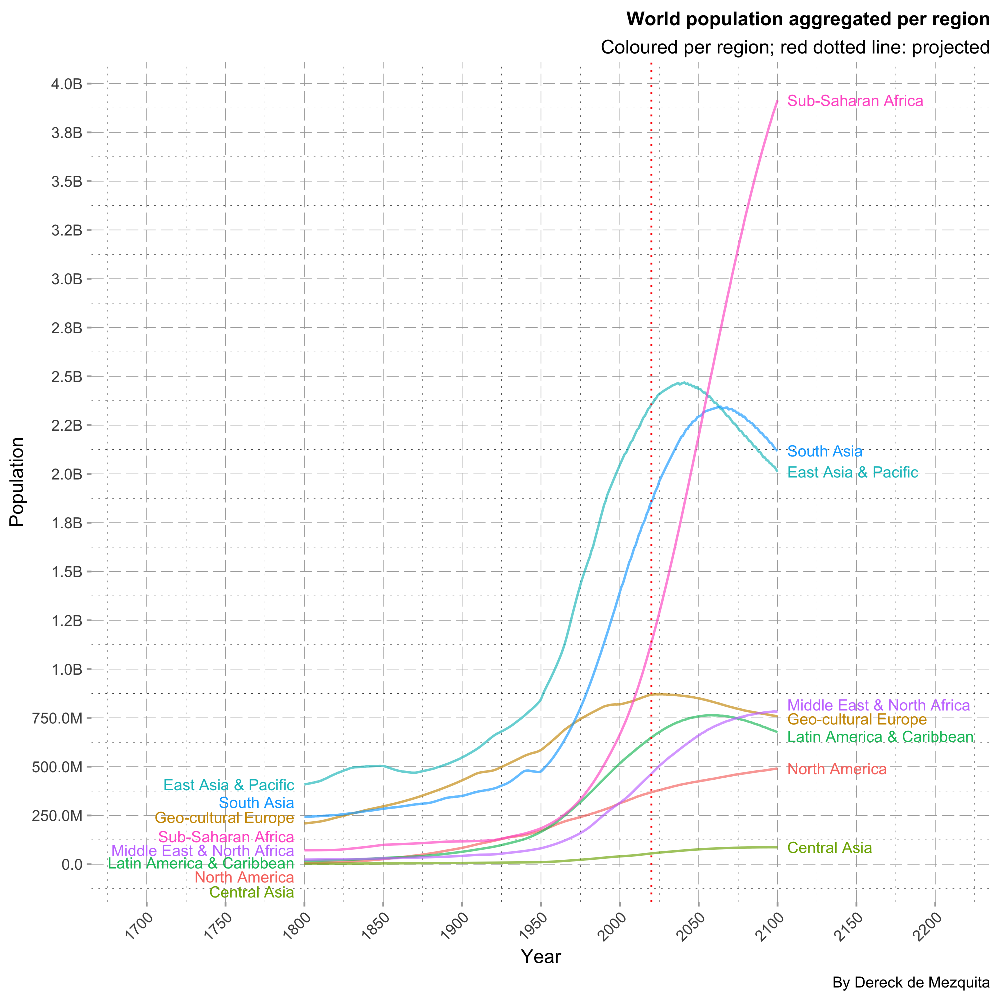
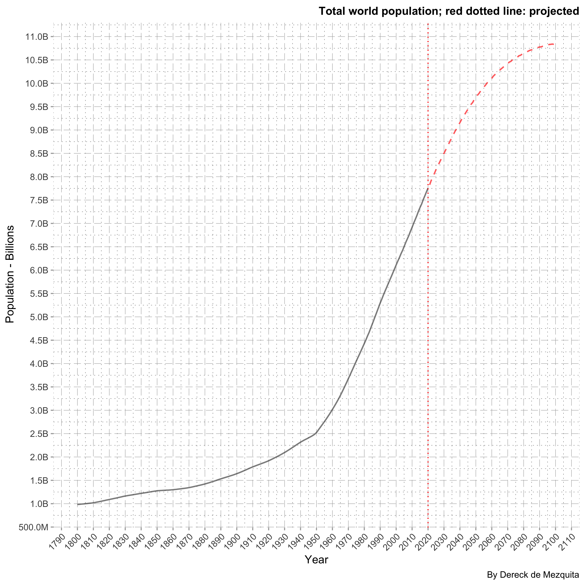
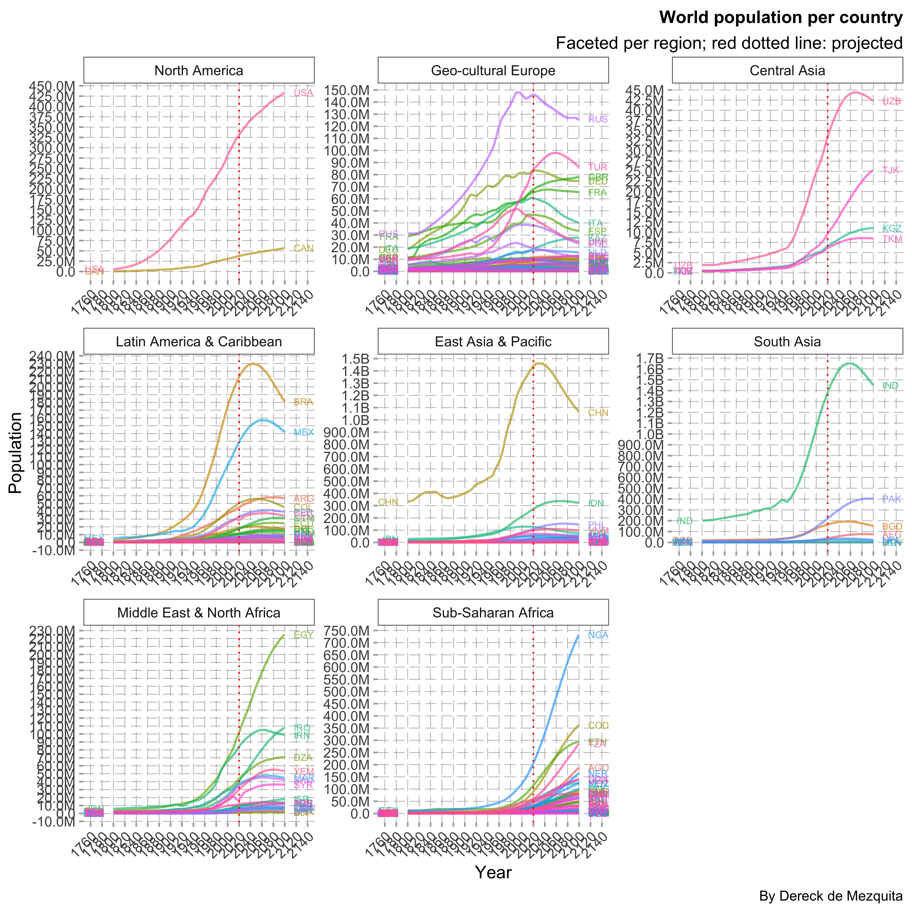

# ds-gapminder

Visualisation and analysis skills by analysing gapminder datasets. Tech stack includes `R`, `tidyverse`, `ggplot2`, `plotly`, `xml2`, `rvest`; `SQLite`; `JavaScript`, `D3.js`; `HTML`, and `CSS`.

I wanted to analyse the gapminder datasets and build a single page website for displaying some beautiful graphics using `D3.js`. I did this is a few parts:

1. Cleaning, organising and merging the datasets.
1. Exploratory analysis and visualisation with `ggplot2`.
1. Final plots and website; `JavaScript`, `D3.js`.

# The dataset: gapminder

The data was taken from the [gapminder website](https://www.gapminder.org) and github repositories: [open-numbers/ddf--gapminder--fasttrack](https://github.com/open-numbers/ddf--gapminder--fasttrack).

Unfortunately the datasets provided are quite messy, it is difficult to obtain the full dataset, and manual download is often necessary for obtain certain ones. Most data is avaialable in the linked repository, but some is only available by manual download. Moreover, this data presents itself in short format. 

Reshaping the data into long format was done by the `clean-data.Rmd` script. There I use a list object to read in all data files, name the object and execute a custom algorithm for reshaping the data and passing the file name to a column name:

```r
# First the data is read and put into long format. This is held by a list object.
reshape_manual_data <- function(x) {
	shift_long <- function(x) {
		x %>%
			column_to_rownames("country") %>%
			t() %>% as.data.frame() %>%
			rownames_to_column("year") %>%
			mutate(year = gsub("X", "", year)) %>%
			reshape2::melt() %>%
			return()
	}
	
	shifted <- lapply(x, shift_long)
	
	for(i in 1:length(x)) {
		colnames(shifted[[i]])[3] <- names(x)[i]
	}
	return(shifted)
}

# This list object is now merged to produce a single dataset, NA are inserted where necessary to keep all rows.
data$manual <- Reduce(function(...) {
	merge(..., all = TRUE)
}, reshape_manual_data(data$manual))
```

Finally all the data is saved to the `SQLite` database found in the `sql` directory. I then use this database with `JavaScript` and `D3.js` to produce the website.

# `ggplot2` visualisations

<p align="center">
    
    
    
    
    
    
    
    
    
    
    
</p>

<p align="center">
    
    
    
    
    
    
</p>

